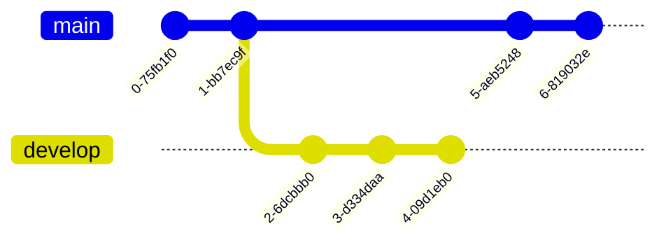

<h1 align="center">GitHub Markdown Cheatsheet</h1>

### GitHub combines a syntax for formatting text called **GitHub Flavored Markdown(GFM)** with a few unique writing features.

### Markdown is an easy-to-read, easy-to-write syntax for formatting plain text. If you want to know more about Markdown, check my repository about [Markdowns](https://github.com/asrtghr/Getting-Started-Markdown)

## Table of Contents

<details><summary></summary>

1. [Headings](#headings)
1. [Alternative Syntax](#alternative-syntax)
1. [Paragraphs](#paragraphs)
1. [Line Breaks](#line-breaks)
   1. [Line Break Best Pratices](#line-break-best-pratices)
1. [Empashis](#empashis)
1. [Emoji](#emoji)
1. [TeX Mathematical Formulae](#tex-mathematical-formulae)
   1. [Writing inline expressions](#writing-inline-expressions)
   1. [Writing expressions as blocks](#writing-expressions-as-blocks)
1. [Blockquotes](#blockquotes)
   1. [Blockquotes with Multiple Paragraphs](#blockquotes-with-multiple-paragraphs)
   1. [Nested Blockquotes](#nested-blockquotes)
   1. [Blockquotes with Other Elements](#blockquotes-with-other-elements)
1. [Hiding content with comments](#hiding-content-with-comments)
1. [Horizontal Rules](#horizontal-rules)
1. [Fenced Code blocks](#fenced-code-blocks)
1. [Syntax Highlighting](#syntax-highlighting)
1. [Warnings](#warnings)
1. [Symbols](#symbols)
1. [Collapsed Section](#collapsed-section)
1. [Diagrams](#diagrams)
   1. [Creating Mermaid Diagrams](#creating-mermaid-diagrams)
   1. [Creating GeoJSON and TopoJSON maps](#creating-geojson-and-topojson-maps)
   1. [Creating STL 3D models](#creating-stl-3d-models)
1. [FootNotes](#footnotes)
1. [Lists](#lists)
   1. [Nested Lists](#nested-lists)
   1. [Task Lists](#task-lists)
1. [Tables](#tables)
   1. [Adding Titles](#adding-titles)
   1. [Escaping Pipe Characters in Tables](#escaping-pipe-characters-in-tables)
1. [Links](#links)
   1. [Adding Titles](#adding-titles)
   1. [Formatting Links](#formatting-links)
   1. [Disabling Automatic URL Linking](#disabling-automatic-url-linking)
1. [Images](#images)
   1. [Linking Images](#linking-images)
   1. [Image Alignment](#image-alignment)
1. [Escaping Characters](#escaping-characters)

</details>

---

## Headings
To create a heading, add number signs **`#`** in front of a word or phrase. The number of number signs you use should correspond to the heading level. For example, to create a **heading level three**, - **`<h3>`** **or** `###` - use three number signs **(e.g., `### My Header`).**
```
# Heading Level 1
## Heading Level 2
### Heading Level 3
#### Heading Level 4
##### Heading Level 5
###### Heading Level 6
```
> [!NOTE]
> **Always put a space between the number signs and the heading name.**

## Alternative Syntax
Since Markdown is a formatting plain text, we can use also use simple **HTML Tags** to write in our **GitHub Document**.
| **&nbsp;&nbsp;&nbsp;Markdown Syntax&nbsp;&nbsp;&nbsp;**              |   **&nbsp;&nbsp;&nbsp;&nbsp;&nbsp;&nbsp;&nbsp;&nbsp;&nbsp;&nbsp;&nbsp;&nbsp;&nbsp;&nbsp;&nbsp;&nbsp;&nbsp;&nbsp;HTML&nbsp;&nbsp;&nbsp;&nbsp;&nbsp;&nbsp;&nbsp;&nbsp;&nbsp;&nbsp;&nbsp;&nbsp;&nbsp;&nbsp;&nbsp;&nbsp;&nbsp;&nbsp;**                         |   &nbsp;&nbsp;&nbsp;&nbsp;&nbsp;&nbsp;&nbsp;&nbsp;&nbsp;&nbsp;&nbsp;&nbsp;&nbsp;&nbsp;&nbsp;&nbsp;&nbsp;&nbsp;&nbsp;&nbsp;&nbsp;&nbsp;&nbsp;&nbsp;&nbsp;&nbsp;&nbsp;&nbsp;**Rendered&nbsp;&nbsp;Output**&nbsp;&nbsp;&nbsp;&nbsp;&nbsp;&nbsp;&nbsp;&nbsp;&nbsp;&nbsp;&nbsp;&nbsp;&nbsp;&nbsp;&nbsp;&nbsp;&nbsp;&nbsp;&nbsp;&nbsp;&nbsp;&nbsp;&nbsp;&nbsp;&nbsp;&nbsp;&nbsp;    |
| :---------------------:            |   :---------------------:          |   :---------------------:   |
| **`# Heading level 1`**	           |   **`<h1>Heading level 1</h1>`**   |   <h1>Heading level 1</h1>  |
| **`## Heading level 2`**	         |   **`<h2>Heading level 2</h2>`**   |   <h2>Heading level 2</h2>  |
| **`### Heading level 3`**	         |   **`<h3>Heading level 3</h3>`**   |   <h3>Heading level 3</h3>  |
| **`#### Heading level 4`**	       |   **`<h4>Heading level 4</h4>`**   |   <h4>Heading level 4</h4>  |
| **`##### Heading level 5`**	       |   **`<h5>Heading level 5</h5>`**   |   <h5>Heading level 5</h5>  |
| **`###### Heading level 6`**	     |    **`<h6>Heading level 6</h6>`**   |   <h6>Heading level 6</h6>  |

## Paragraphs
To create a paragraph in your document, use a blank line to separate blocks of text.
```
I really like using Markdown.

I think I'll use it to format all of my documents from now on.
```

You can also use the **HTML Tag** `<p> </p>` to create a paragraph in your document.
```
<p>I really like using Markdown.</p>
<p>I think I'll use it to format all of my documents from now on.</p>
```

>[!NOTE]
> **In this case it's not necessary to separate blocks of text with a blank line.**

<h3 align = "center"> A Quick Reminder </h3>

| :heavy_check_mark: Do This&nbsp;&nbsp;&nbsp;&nbsp;&nbsp;&nbsp;&nbsp;&nbsp;&nbsp;&nbsp;&nbsp;&nbsp;&nbsp;&nbsp;&nbsp;&nbsp;&nbsp;&nbsp;&nbsp;&nbsp;&nbsp;&nbsp;&nbsp;&nbsp;&nbsp;&nbsp;&nbsp;&nbsp;&nbsp;&nbsp;&nbsp;&nbsp;&nbsp;&nbsp;&nbsp;&nbsp;&nbsp;&nbsp;&nbsp;&nbsp;&nbsp;&nbsp;&nbsp;&nbsp;&nbsp;&nbsp;&nbsp;&nbsp;&nbsp;&nbsp;&nbsp;&nbsp;&nbsp;&nbsp;&nbsp;&nbsp;&nbsp;&nbsp;&nbsp;&nbsp;&nbsp;&nbsp;&nbsp;&nbsp;&nbsp;&nbsp;| :x: Don't Do This&nbsp;&nbsp;&nbsp;&nbsp;&nbsp;&nbsp;&nbsp;&nbsp;&nbsp;&nbsp;&nbsp;&nbsp;&nbsp;&nbsp;&nbsp;&nbsp;&nbsp;&nbsp;&nbsp;&nbsp;&nbsp;&nbsp;&nbsp;&nbsp;&nbsp;&nbsp;&nbsp;&nbsp;&nbsp;&nbsp;&nbsp;&nbsp;&nbsp;&nbsp;&nbsp;&nbsp;&nbsp;&nbsp;&nbsp;&nbsp;&nbsp;&nbsp;&nbsp;&nbsp;&nbsp;&nbsp;&nbsp;&nbsp;&nbsp;&nbsp;&nbsp;&nbsp;&nbsp;&nbsp;&nbsp;&nbsp;&nbsp;&nbsp;&nbsp;&nbsp;&nbsp;&nbsp;&nbsp; |
| :----                                                             | :----                                                       |
| Don't put tabs or spaces in front of your paragraphs.             |&nbsp;&nbsp;&nbsp;&nbsp;&nbsp;This can result in unexpected formatting problems. |

> [!WARNING]
> **Unless the paragraph is in a list, don’t indent paragraphs with spaces or tabs.**

## Line Breaks
To create a *line break* in your document, you can do that by simply using the **HTML Tag** `<br>`, or end a line with `two more spaces`.  
```
This is the first line of your document  <-- two spaces 
And this is the second line of your document
```
```
This is the first line of your document<br>
And this is the second line of your document
```

### Line Break Best Pratices
You can use two or more spaces (commonly referred to as *"trailing whitespace"*) for line breaks in nearly every **Markdown application**, but it’s hard to see *trailing whitespace* in an editor, and many people accidentally or intentionally put two spaces after every sentence. For this reason, you may want to use something other than trailing whitespace for line breaks.

Other topic commonly speaked is the use of backslash `\` at the end of line. You can get in trouble using that because **not all Markdown applications support this, so it isn’t a great option from a compatibility perspective.**

| :heavy_check_mark: Do This&nbsp;&nbsp;&nbsp;&nbsp;&nbsp;&nbsp;&nbsp;&nbsp;&nbsp;&nbsp;&nbsp;&nbsp;&nbsp;&nbsp;&nbsp;&nbsp;&nbsp;&nbsp;&nbsp;&nbsp;&nbsp;&nbsp;&nbsp;&nbsp;&nbsp;&nbsp;&nbsp;&nbsp;&nbsp;&nbsp;&nbsp;&nbsp;&nbsp;&nbsp;&nbsp;&nbsp;&nbsp;&nbsp;&nbsp;&nbsp;&nbsp;&nbsp;&nbsp;&nbsp;&nbsp;&nbsp;&nbsp;&nbsp;&nbsp;&nbsp;&nbsp;&nbsp;&nbsp;&nbsp;&nbsp;&nbsp;&nbsp;&nbsp;&nbsp;&nbsp;&nbsp;&nbsp;&nbsp;&nbsp;&nbsp;&nbsp;| :x: Don't Do This&nbsp;&nbsp;&nbsp;&nbsp;&nbsp;&nbsp;&nbsp;&nbsp;&nbsp;&nbsp;&nbsp;&nbsp;&nbsp;&nbsp;&nbsp;&nbsp;&nbsp;&nbsp;&nbsp;&nbsp;&nbsp;&nbsp;&nbsp;&nbsp;&nbsp;&nbsp;&nbsp;&nbsp;&nbsp;&nbsp;&nbsp;&nbsp;&nbsp;&nbsp;&nbsp;&nbsp;&nbsp;&nbsp;&nbsp;&nbsp;&nbsp;&nbsp;&nbsp;&nbsp;&nbsp;&nbsp;&nbsp;&nbsp;&nbsp;&nbsp;&nbsp;&nbsp;&nbsp;&nbsp;&nbsp;&nbsp;&nbsp;&nbsp;&nbsp;&nbsp;&nbsp;&nbsp;&nbsp; |
| :----                                                               | :----                                                       |
| First line using two spaces after.<br> The next line.               | First line with a backslash after.\ <br>The next line.      |
| First line using the HTML tag after.`<br>`<br> The next line.       | First line with nothing after.<br>The next line.            |    

## Empashis
Through styling text commands you can personalize your document according to you own taste. You can indicate emphasis with **bold**, **italic**, **strikethrough**, **subscript**, or **superscript** text in comment fields.


| Style                  | Syntax                   | Keyboard Shortcut                                      | Example                                   | Output          |  
| :-------------:        | :-------------:          | :-------------:                                        | :-------------:                           | :-------------: |
| Bold                   | `** **`                  | `Command` + `B` (Mac) or `Ctrl` + `B` (Windows/Linux)  | `**This is bold text**`                   | **This is bold text**        |
| Italic                 | `* *` or `_ _`           | `Command` + `I` (Mac) or `Ctrl` + `I` (Windows/Linux)  | `*This text is italicized*`               | *This text is italicized*   |
| Strikethrough          | `~~ ~~`                  |  `None`                                                | `~~This was mistaken text~~`              | ~~This was mistaken text~~ |
| Bold and nested italic | `** **` and <br> `__ __` |  `None`                                                | `**This text is _extremely_ important**`  | **This text is _extremely_ important**|
| All bold and italic    | `*** ***`                |  `None`                                                | `***All this text is important***`        | ***All this text is important***      |
| Subscript              | `<sub> </sub>`           |  `None`                                                | `H<sub>2</sub>O`                          | H<sub>2</sub>O   |
| Superscript            | `<sup> </sup>`           |  `None`                                                | `X<sup>2</sup>`                           | X<sup>2</sup> |

## Emoji
**You can add emoji to your document by two different ways: *copy and paste* from a source into your file, or type *Emoji Shortcodes* - `:EMOJICODE:`.**

### Copying and Pasting Emoji
In most cases, *you can simply copy an `emoji` from a source and paste it into your document*. Many **Markdown** applications will automatically display the `emoji` in the **Markdown-Formatted Text**. 😄

### Using Emoji Shortcodes
Some **Markdown** applications allow you to insert emoji by typing **emoji shortcodes**. These, **begin and end with a colon and include the name of an emoji.**
```
- Go to the gym 8:30 AM :heavy_check_mark:
- Go to the Market :heavy_check_mark:
- Take a walk with my dog :x:
```
- Go to the gym 8:30 AM :heavy_check_mark:
- Go to the Market :heavy_check_mark:
- Take a walk with my dog :x:

> [!NOTE]
> **You can use** [this list of emoji shortcodes](https://gist.github.com/rxaviers/7360908) **for more reference.**

## TeX Mathematical Formulae
To enable clear communication of mathematical expressions, GitHub supports LaTeX formatted math within Markdown. For more information, see [LaTeX/Mathematics](https://en.wikibooks.org/wiki/LaTeX/Mathematics) in Wikibooks.

GitHub's math rendering capability uses MathJax; an open source, JavaScript-based display engine. MathJax supports a wide range of [LaTeX](https://pt.wikipedia.org/wiki/LaTeX) macros, and several useful accessibility extensions. For more information, see the [MathJax documentation](https://docs.mathjax.org/en/latest/input/tex/index.html#tex-and-latex-support).

<br>

### Writing inline expressions
To include a math expression inline with your text, **delimit the expression with a dollar symbol** `$`.
```
This sentence uses `$` delimiters to show math inline:  $f(x)=(x+a)(x+b^2)$
```
This sentence uses `$` delimiters to show math inline:  $f(x)=(x+a)(x+b^2)$

<br>

### Writing expressions as blocks
To add a math expression as a block, start a new line and **delimit the expression with two dollar symbols** `$$`.
```
**L'Hôpital's rule:**

$$\lim_{x\to 0}{\frac{e^x-1}{2x}}
\overset{\left[\frac{0}{0}\right]}{\underset{\mathrm{H}}{=}} 
\lim_{x\to 0}{\frac{e^x}{2}}={\frac{1}{2}}$$
```
**L'Hôpital's rule:**

$$\lim_{x\to 0}{\frac{e^x-1}{2x}} \overset{\left[\frac{0}{0}\right]}{\underset{\mathrm{H}}{=}} \lim_{x\to 0}{\frac{e^x}{2}}={\frac{1}{2}}$$

<br>

### Writing dollar signs in line with and within mathematical expressions
To display a dollar sign as a character in the same line as a mathematical expression, you need to escape the non-delimiter `$` to ensure the line renders correctly.
```
Within a math expression, add a \ symbol before the explicit $. (\$)
```

> [!IMPORTANT]
> **The beginning and ending dollar signs ($) are the delimiters for the TeX Markup.**

<br>

## Blockquotes
Whenever you feel the necessity to quote some important information to your document or simply add some references, *blockquote* can come very in hand.

To create a *blockquote* on your document, add a `>` in front of a paragraph.
```
> *Life is like a box of chocolates. You never know what you’re going to get.* , ***Forest Gump***
```
> *Life is like a box of chocolates. You never know what you’re going to get.* , ***Forest Gump.***

#

### Blockquotes with Multiple Paragraphs
*Blockquotes* can contain multiple paragraphs of information. To agroup a amount of information in one *blockquote*, add a `breakline` after each paragraph, or simply use a `blank line` between them.
```
> You're late, Gandalf!.
>
> A wizard is never late, nor is he early. He arrives precisely when he means to.
```
> You're late, Gandalf!.
>
> A wizard is never late, nor is he early. He arrives precisely when he means to.

#

### Nested Blockquotes
*Blockquotes* can be nested. Add a `>>` in front of the paragraph you want to nest.
```
> You're late, Gandalf!.
>
>> A wizard is never late, nor is he early. He arrives precisely when he means to.
```
> You're late, Gandalf!.
>
>> A wizard is never late, nor is he early. He arrives precisely when he means to.

#

### Blockquotes with Other Elements
*Blockquotes* can contain other ***Markdown formatted elements***. Not **all** elements can be used — you’ll need to experiment to see which ones work.
```
> ## This is looking great!
>  *Everything* is going according to **plan**. :+1:
```
> ## This is looking great!
>  *Everything* is going according to **plan**. :+1:

<br>

## Hiding content with comments
You can tell **GitHub** to hide content from the rendered **Markdown** by placing the content in an ***HTML** comment**.
```
<!-- This content will not appear in the rendered Markdown !-->
```

## Horizontal Rules
To create a ***horizontal rule***, use at least three **`asterisks`** , **`dashes`** or **`underscores`** on a line by themselves.
```
***

---

___
```
___


## Fenced Code Blocks 
You can create ***fenced code*** blocks by placing **triple backticks** - ` ``` ` - before and after the code block. It's commonly recommended placing a blank line before and after code blocks to make the raw formatting easier to read.

```
This is a paragraph inside of a Fenced Code Blocks.
```

<br>

`````
````
```
Now you can see backticks inside a fenced code block. 
```
````
`````

> [!IMPORTANT]
> **To display triple backticks in a fenced code block, wrap them inside quadruple backticks.**


## Syntax Highlighting 
Fenced code blocks are part of the Markdown spec, but syntax highlighting isn't. However, many renderers -- like **Github's** and **Markdown Here** -- support syntax highlighting. **To see the complete list, and how to write the language names, see the [highlight.js](https://highlightjs.org/static/demo/) demo page.**

 **You can add an optional language identifier to enable syntax highlighting in your fenced code block.**

````
```C
void helloWorld(){
   printf("Hello World");
}
```
```` 

```C
void helloWorld(){
   printf("Hello World");
}
```

<br>

````
```ruby
require 'redcarpet'
markdown = Redcarpet.new("Hello World!")
puts markdown.to_html
```
````

```ruby
require 'redcarpet'
markdown = Redcarpet.new("Hello World!")
puts markdown.to_html
```

> [!IMPORTANT]
> **If there's no language indicated, the output will be as showned in the previous topic.**

## Warnings
Warnings are Markdown extensions used to highlight critical information. They are shown with differents colors and icons to indicate the content importance.

#### There are three available types of warnings.

```
> [!NOTE]
> Highlights information that users should take into account, even when skimming.
```
> [!NOTE]
> Highlights information that users should take into account, even when skimming.

<br>

```
> [!IMPORTANT]
> Crucial information necessary for users to succeed.
```
> [!IMPORTANT]
> Crucial information necessary for users to succeed.

<br>

```
> [!WARNING]
> Critical content demanding immediate user attention due to potential risks.
```
> [!WARNING]
> Critical content demanding immediate user attention due to potential risks.

## Symbols 
**Markdown** doesn’t provide special syntax for symbols. However, in most cases, you can **copy and paste** whatever symbol you want to use into your document. **Here’s a partial list of HTML entities for symbols:**

|**Description**&nbsp;&nbsp;&nbsp;&nbsp;&nbsp;&nbsp;&nbsp;&nbsp;&nbsp;&nbsp;&nbsp;&nbsp;&nbsp;&nbsp;&nbsp;&nbsp;&nbsp;&nbsp;&nbsp;&nbsp;&nbsp;&nbsp;&nbsp;&nbsp;&nbsp;&nbsp;&nbsp;&nbsp;&nbsp;&nbsp;&nbsp;&nbsp;&nbsp;&nbsp;&nbsp;&nbsp;&nbsp;&nbsp;&nbsp;&nbsp;&nbsp;&nbsp;&nbsp;&nbsp;&nbsp;&nbsp;&nbsp;&nbsp;&nbsp;&nbsp;|**Entity Name**&nbsp;&nbsp;&nbsp;&nbsp;&nbsp;&nbsp;&nbsp;&nbsp;&nbsp;&nbsp;&nbsp;&nbsp;&nbsp;&nbsp;&nbsp;&nbsp;&nbsp;&nbsp;&nbsp;&nbsp;&nbsp;&nbsp;&nbsp;&nbsp;&nbsp;&nbsp;&nbsp;&nbsp;&nbsp;&nbsp;&nbsp;&nbsp;&nbsp;&nbsp;&nbsp;&nbsp;&nbsp;&nbsp;&nbsp;&nbsp;&nbsp;&nbsp;&nbsp;&nbsp;&nbsp;&nbsp;&nbsp;| **Rendered Output**&nbsp;&nbsp;&nbsp;&nbsp;&nbsp;&nbsp;&nbsp;&nbsp;&nbsp;&nbsp;&nbsp;&nbsp;&nbsp;&nbsp;&nbsp;&nbsp;&nbsp;&nbsp;&nbsp;&nbsp;&nbsp;&nbsp;&nbsp;&nbsp;&nbsp;&nbsp;&nbsp;&nbsp;&nbsp;&nbsp;&nbsp;&nbsp;  |
| :----                         | :----            | :----          |
| **`Copyright`**               | `&copy;`         | &copy;         |
| **`Registered trademark`**    | `&reg;`          | &reg;          |
| **`Trademark`**               | `&trade;`        | &trade;        |
| **`Euro`**                    | `&euro;`         | &euro;         |
| **`Cent`**                    | `&cent;`         | &cent;         |
| **`Pound`**                   | `&pound;`        | &pound;        |
| **`Yen`**                     | `&yen;`          | &yen;          |
| **`Degree`**                  | `&#176;`         | &#176;         |
| **`Pi`**                      | `&#960;`         | &#960;         |
| **`Left Arrow`**              | `&larr;`         | &larr;         |
| **`Up Arow`**                 | `&uarr;`         | &uarr;         |
| **`Right Arrow`**             | `&rarr;`         | &rarr;         |
| **`Down Arrow`**              | `&darr;`         | &darr;         | 

<br>

> **Note**
> **If you want to see more examples, check the [w3schools page](https://www.w3schools.com/html/html_symbols.asp) for reference.**

## Collapsed Section
You can streamline your **Markdown** by creating a collapsed section with `<details>` and `<sumary>` tags.

**Any Markdown within the** `<details>` **block will be collapsed until the reader clicks to expand the details.**

```
<details><summary>CLICK ME</summary>

#### We can hide anything, even code!

</details>
```

## Diagrams
You can create diagrams in **Markdown** using three different syntaxes: **mermaid ,  geoJSON  and  topoJSON, and  ASCII STL**. Diagram rendering is available in **GitHub Issues**, **GitHub Discussions, pull requests, wikis, and Markdown files**.

### Creating Mermaid Diagrams
**Mermaid** is a Markdown-inspired tool that renders text into diagrams. For example, Mermaid can render flow charts, sequence diagrams, pie charts and more. **Check the [Mermaid documentation](https://mermaid-js.github.io/mermaid/#/) for more reference.**

**To create a mermaid diagram, add mermai syntax inside a fenced code block with the mermaid language identifier. If you're still in doubt about that, [check this topic](#syntax-highlighting).**

**For example, you can create a Git graph**:



### Creating GeoJSON and TopoJSON maps    
You can use **GeoJSON/TopoJSON** syntax to create interactive maps. To create a map, add **GeoJSON or TopoJSON inside a fenced code block with the geojson or topojson syntax identifier**.

**For example, you can create a simple map**:
```geojson
{
  "type": "FeatureCollection",
  "features": [
    {
      "type": "Feature",
      "id": 1,
      "properties": {
        "ID": 0
      },
      "geometry": {
        "type": "Polygon",
        "coordinates": [
          [
              [-90,35],
              [-90,30],
              [-85,30],
              [-85,35],
              [-90,35]
          ]
        ]
      }
    }
  ]
}
```
    
### Using TopoJSON

```topojson
{
  "type": "Topology",
  "transform": {
    "scale": [0.0005000500050005, 0.00010001000100010001],
    "translate": [100, 0]
  },
  "objects": {
    "example": {
      "type": "GeometryCollection",
      "geometries": [
        {
          "type": "Point",
          "properties": {"prop0": "value0"},
          "coordinates": [4000, 5000]
        },
        {
          "type": "LineString",
          "properties": {"prop0": "value0", "prop1": 0},
          "arcs": [0]
        },
        {
          "type": "Polygon",
          "properties": {"prop0": "value0",
            "prop1": {"this": "that"}
          },
          "arcs": [[1]]
        }
      ]
    }
  },
  "arcs": [[[4000, 0], [1999, 9999], [2000, -9999], [2000, 9999]],[[0, 0], [0, 9999], [2000, 0], [0, -9999], [-2000, 0]]]
}
```    
    
### Creating STL 3D models    
ou can use **ASCII STL** syntax directly in markdown to create **interactive 3D models**. To display a model, add **ASCII STL syntax inside a fenced code block with the stl syntax identifier**.

**For example, you can create a simple 3D model**:    
 ```stl
solid cube_corner
  facet normal 0.0 -1.0 0.0
    outer loop
      vertex 0.0 0.0 0.0
      vertex 1.0 0.0 0.0
      vertex 0.0 0.0 1.0
    endloop
  endfacet
  facet normal 0.0 0.0 -1.0
    outer loop
      vertex 0.0 0.0 0.0
      vertex 0.0 1.0 0.0
      vertex 1.0 0.0 0.0
    endloop
  endfacet
  facet normal -1.0 0.0 0.0
    outer loop
      vertex 0.0 0.0 0.0
      vertex 0.0 0.0 1.0
      vertex 0.0 1.0 0.0
    endloop
  endfacet
  facet normal 0.577 0.577 0.577
    outer loop
      vertex 1.0 0.0 0.0
      vertex 0.0 1.0 0.0
      vertex 0.0 0.0 1.0
    endloop
  endfacet
endsolid
```  
    
> [!NOTE]
> **For more information on working with `.geojson` , `.topojson` and `.stl` files, see ["Working with non-code files."](https://docs.github.com/en/repositories/working-with-files/using-files/working-with-non-code-files#mapping-geojson-files-on-github)**

> [!NOTE]
> **This topic is a reference to the original content: ["Creating diagrams."](https://docs.github.com/en/get-started/writing-on-github/working-with-advanced-formatting/creating-diagrams)**
    
## Footnotes
*Footnotes* allows you to add **notes** and **references** without cluttering the body of the document. Readers can click the link to jump to the content of the footnote at the bottom of the page.

To create a *footnote* reference, add a **caret and an identifier inside brackets** - `[^identifier]`. **Identifiers can be numbers or words, but they can’t contain spaces or tabs.**

```
Here is a simple footnote[^1].

A footnote can also have multiple lines[^2].  

You can also use words, to fit your writing style more closely[^note].

[^1]: [My reference](https://github.com).
[^2]: Every new line should be prefixed with 2 spaces. 
[^note]: Named footnotes allow easier identification and linking.  
```
> [!IMPORTANT]
> **Identifiers only correlate the footnote reference with the footnote itself — in the output, footnotes are numbered sequentially.**

## Lists
There are a few ways to create a list in **GitHub Markdown** that can adapt to your specific use.

### Ordered Lists
To create an ordered list, add line items with numbers followed by periods. 

The numbers don’t have to be in numerical order, but the list should start with the number one.

```
1. First Item
1. Second Item
1. Third Item
```
**The rendered output looks like this:**

1. I was born in 2000.
1. *2010\. A great year!*
1. > I love 80's songs.

<br>

# 

### Unordered Lists
To create an unordered list, add **dashes** `-`, **asterisks** `*`, or **plus signs** `+` in front of line items.
```
- First Item
- Second Item
- Third Item
```
**The rendered output looks like this:**

- I was born in 2000.
- *2010\. A great year!*
- > I love 80's songs.
 
#

### Nested Lists
You can create a nested list by indenting one or more list items below another item. 

Type space characters in front of your nested list item, **until the list marker character `-` or `*` lies directly below the first character of the text in the item above it.** The same procedure will be necessary if you want yo create a orderned nested list.

### Ordered Nested List
```
1. First Item
   1. First Sub-Item
   1. Second Sub-Item
2. Second Item
```

### Unordered Nested List
```
* First Item
  * First Sub-Item
  * Second Sub-Item
* Second Item
```

> **Note**
> **It's possible to use emphasis with any type of list.**

### Task Lists
To create a task list, type **square brackets** `[ ]` before list itens. **To check a task**, do `[x]`.
```
- [x] Wake up 7:00 AM 
- [ ] \(Optional) Go to Gym 8:30 AM
```
**The rendered output looks like this:**

- [x] Wake up 7:00 AM 
- [ ] \(Optional) Go to Gym 8:30 AM

## Tables
You can create tables with pipes `|` and hyphens `-`. Hyphens are used to create each column's header, while pipes separate each column. You must include a blank line before your table in order for it to correctly render.
```
|  First Header  |  Second Header |
|  ------------- |  ------------- |
|  Content Cell  |  Content Cell  |
|  Content Cell  |  Content Cell  |
```

### Alignment
You can align text in the columns to the left, right, or center by adding a colon `:` to the left, right, or on both side of the hyphens within the header row.
```
|  Left-aligned   |  Center-aligned |  Right-aligned  |
|  :---           |  :---:          |  ---:           |
|  Content Cell   |  Content Cell   |  Content Cell   |
|  Content Cell   |  Content Cell   |  Content Cell   |
```
**The rendered output looks like this:**

|  Left-aligned  |  Center-aligned  |  Right-aligned  |
|  :---          |  :---:           |  ---:           |
|  Header        |  Title           |  Here's this    |
|  Paragraph     |  Text            |  And more       |

### Escaping Pipe Characters in Tables
To include a pipe | as content within your cell, use a \ before the pipe:
```
| Name     | Character |
| ---      | ---       |
| Backtick | `         |
| Pipe     | \|        |
```

> **Warning**
> **You can’t use headings, blockquotes, lists, horizontal rules, images, or most HTML tags.**

## Links
You can create an inline link by wrapping link text in **brackets** `[ ]`, and then wrapping the URL in **parentheses** `( )`.
```
[Google](https://www.google.com)
```

### Adding Titles
You can optionally add a title for a link. This will appear as a tooltip when the user hovers over the link. To add a title, enclose it in quotation marks after the **URL**.
```
[Google](https://www.google.com "Link to Google page")
```

### Formatting Links
To **emphasize** links, add asterisks before and after the `[ ]` and `( )`. 

**To denote links as code, add backticks in the brackets.**
```
**[Google]**(https://www.google.com)

**Check this [*page*](https://www.google.com)**

See the section on [`Google`](https://www.google.com).
```

### Disabling Automatic URL Linking
If you don’t want a URL to be automatically linked, you can remove the link by denoting the URL as code with backticks.
```
`https://www.google.com`
```

## Images
**To add an image, add an exclamation mark `!` , followed by alt text in brackets, and the path or URL to the image asset in parentheses.** You can optionally add a title in quotation marks after the **path or URL**.

```


```


### Linking Images
To add a link to an image, enclose the **Markdown** for the image in brackets, and then add the link in parentheses.

```
[](https://github.com)
```

[](https://github.com)

### Image Alignment  
Normal **Markdown** image tags don’t allow for any alignment properties in **README.md**.
```
<!-- No alignment options -->

```
With **HTML** image tag it's possible to align your image according to your necessity.

#### Left Alignment

```html

```

#### Right Alignment

```html

```

#### Center Alignment

```html
<p align="center">
  
</p>
```

## Escaping Characters
To display a literal character that would otherwise be used to format text in a **Markdown** document, add a **backslash** `\` in front of the character. **You can use a backslash to escape the following characters.**

|&nbsp;&nbsp;&nbsp;&nbsp;&nbsp;&nbsp;&nbsp;&nbsp;&nbsp;&nbsp;&nbsp;&nbsp;&nbsp;&nbsp;&nbsp;&nbsp;&nbsp;&nbsp;&nbsp;&nbsp;&nbsp;&nbsp;&nbsp;&nbsp;Character&nbsp;&nbsp;&nbsp;&nbsp;&nbsp;&nbsp;&nbsp;&nbsp;&nbsp;&nbsp;&nbsp;&nbsp;&nbsp;&nbsp;&nbsp;&nbsp;&nbsp;&nbsp;&nbsp;&nbsp;&nbsp;&nbsp;&nbsp;&nbsp;|&nbsp;&nbsp;&nbsp;&nbsp; &nbsp;&nbsp;&nbsp;&nbsp;&nbsp;&nbsp;&nbsp;&nbsp;&nbsp;&nbsp;&nbsp;&nbsp;&nbsp;&nbsp;&nbsp;&nbsp;&nbsp;&nbsp;&nbsp; &nbsp;&nbsp;&nbsp;&nbsp;&nbsp;&nbsp;&nbsp;&nbsp;&nbsp;&nbsp;&nbsp;&nbsp;&nbsp;&nbsp;&nbsp;&nbsp;&nbsp;&nbsp;&nbsp;&nbsp;&nbsp;&nbsp;&nbsp;&nbsp;&nbsp;&nbsp;Name&nbsp;&nbsp; &nbsp;&nbsp;&nbsp;&nbsp;&nbsp;&nbsp;&nbsp;&nbsp;&nbsp;&nbsp;&nbsp;&nbsp;&nbsp;&nbsp;&nbsp;&nbsp;&nbsp;&nbsp;&nbsp; &nbsp;&nbsp;&nbsp;&nbsp;&nbsp;&nbsp;&nbsp;&nbsp;&nbsp;&nbsp;&nbsp;&nbsp;&nbsp;&nbsp;&nbsp;&nbsp;&nbsp;&nbsp;&nbsp;&nbsp;&nbsp;&nbsp;&nbsp;&nbsp;&nbsp;&nbsp;&nbsp;&nbsp;|
| :---:           | :---:                     |
| `\`	            | **backslash**             |
| ` `` `	         | **backtick**              |
| `*`	            | **asterisk**              |
| `_`	            | **underscore**            |     
| `{ }`	         | **curly braces**          |
| `[ ]`	         | **brackets**              |
| `< >`	         | **angle brackets**        |  
| `( )`	         | **parentheses**           |
| `#`	            | **pound sign**            |
| `+`	            | **plus sign**             |
| `-`	            | **minus sign (hyphen)**   |
| `.`	            | **dot**                   |
| `!`	            | **exclamation mark**      |
| `\|`	         | **pipe**                  |

---
<!--   --!>
<!-- https://github.com/ikatyang/emoji-cheat-sheet/blob/master/README.md !-->
<!-- > **Note**--!>
<!-- > This is a note--!>

<!-- > **Warning**--!>
<!-- > This is a warning--!>
<!-- > :bulb: **Tip:** Remember to appreciate the little things in life. --!>
